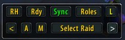
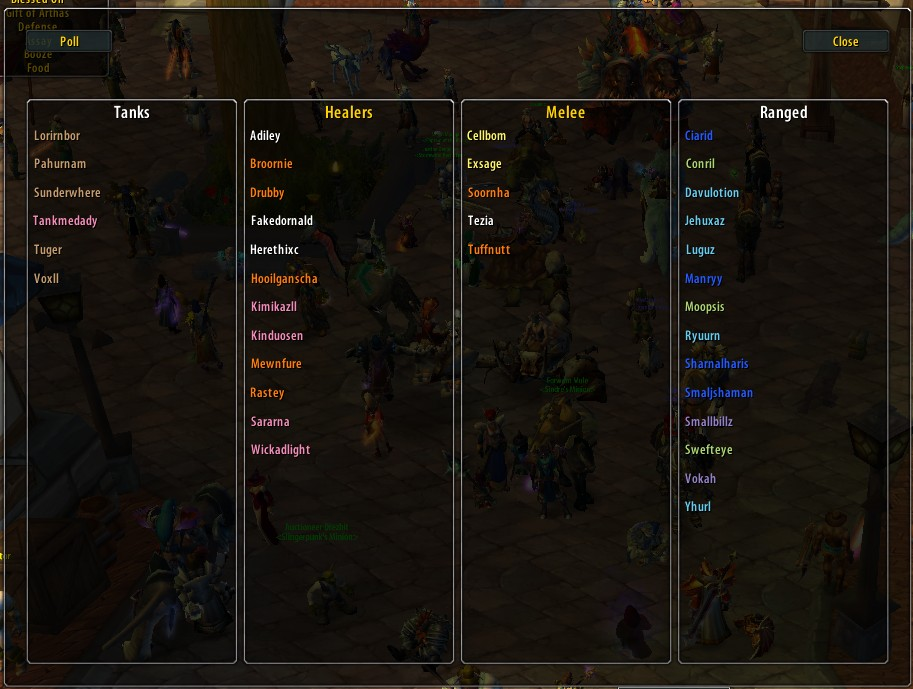
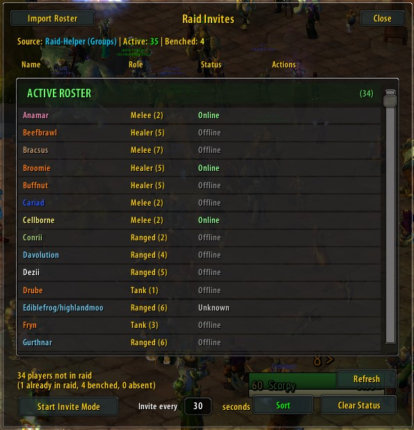
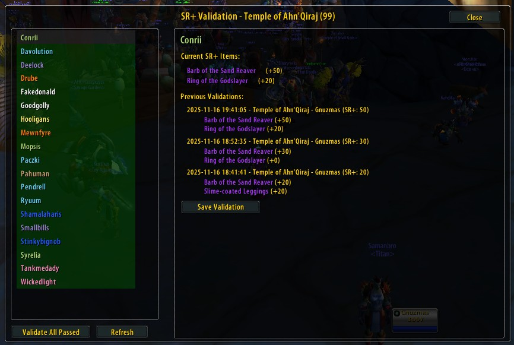
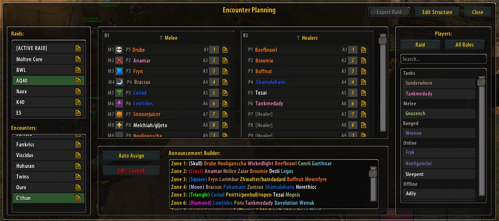
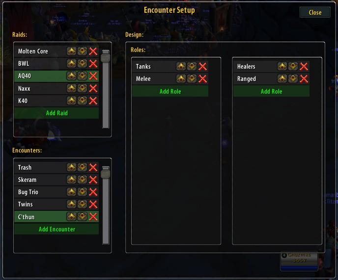

w# OG-RaidHelper

**Version:** 1.8.1  
**Author:** Gnuzmas
**Special Thanks:** Claude v4.5, Blood and Thunder Leadership, Pepopo
**Compatible with:** World of Warcraft 1.12.1 (Vanilla / Turtle WoW)

A comprehensive raid management addon for organizing encounters, assigning roles, managing trade distributions, coordinating raid activities, and validating soft-reserve integrity.



---

## Dependencies

**Required:**
- **[RollFor](https://github.com/jasonp1992/RollFor)** - Soft-reserve addon that provides the underlying SR data for the Raid Invites and SR+ Validation features. OG-RaidHelper reads RollFor's encoded soft-reserve data to display player SR+ values and item lists.

**Installation:**
1. Install RollFor addon first
2. Configure your soft-reserve data in RollFor
3. OG-RaidHelper will automatically detect and use RollFor data

---
## Disclaimer

This addon is entirely vibe coded using Claude Sonnet 3.5 and 4.5.  I deliberately kept myself out of the code because I want to bolster my knowledge of AI in the workplace, and what better way to do that than to create an entire TWoW addon.

The documentation that follows is also entirely created by Claude, and I can tell you right now Claude did some acid at some point and he has hallucinations from time to time.  I already found and removed one blatant error in the documentation, but I'm sure there's more.

That said it's 1:00AM and I've had about 5 hours of sleep a night for the past 4 nights working on this addon.'

---
## First Run
In the addon folder you will find defaults.txt, when you first run the addon it's all empty.  If you open the share dialog you'll find a place you can paste the contents of defaults.txt which will give you a head start using the addon.

Alternatively you can get in a raid with a player that's already set this up and sync the data from them.

Documentation is a work in progress... this addon  has changed a lot since it's inception so I apologize for any errors in the documentation... that said this is written for raiders, not readers, so I'll get an updated youtube video posted soon.

---

## Table of Contents

- [Dependencies](#dependencies)
- [Installation](#installation)
- [Quick Start](#quick-start)
- [Main Window](#main-window)
- [Roles Window](#roles-window)
- [Raid Invites System](#raid-invites-system)
- [SR+ Validation System](#sr-validation-system)
- [Encounters System](#encounters-system)
- [Trade System](#trade-system)
- [Share System](#share-system)
- [Poll System](#poll-system)
- [Slash Commands](#slash-commands)
- [Announcement Tags](#announcement-tags)

---

## Installation

1. Extract the `OG-RaidHelper` folder to your `Interface\AddOns` directory
2. Restart World of Warcraft or type `/reload` if you are just updating in-game
3. You should see the OG-RaidHelper main window on your screen or the mini map button RH.
4. Seriously, skip all this and use the GIT Addon manager.

---

## Quick Start

1. **Access Main UI**: The small main window appears on login or type `/ogrh` or click the mini map button.
2. **Install RollFor**: Required for Raid Invites and SR+ Validation features
3. **Open Roles Window**: Click the **Roles** button to manage your raid composition
4. **Poll for Roles**: Use the **Poll** button to request players sign up via raid chat
5. **Setup Encounters**: Click **Encounters** → **Manage** to access encounter planning
6. **Raid Invites**: Click minimap → **Raid Invites** to invite players from soft-reserve list
7. **SR+ Validation**: Click minimap → **SR Validation** to track SR+ changes over time
8. **Trade Items**: Use the **Trade** button to set up and distribute items to raid members
9. **Share Configs**: Click **Share** to export/import your encounter and trade configurations

10. A short video overview of the addon since I know you're raiders not readers.
    https://youtu.be/eKVEandwlpM
   
---

## Main Window

The compact main window provides quick access to all major features.

### Window Controls

Located in the title bar:
- **RC** - Performs a Ready Check (left-click), or toggle remote ready checks on/off (right-click)
- **S** - Syncronize Data to other raiders.  Left click to send the selected encounter, right click to lock so you don't accept data from other raiders.
- **-** - Minimize/expand window
- **L** - Lock/unlock window position (drag to move when unlocked)

### Minimized Window Controls

When the main window is minimized, encounter navigation controls appear:
- **<** (Previous) - Navigate to the previous encounter in the list
- **A** (Announce) - Prepare the current encounter's announcement (opens in chat box)
- **M** (Mark) - Mark players according to encounter configuration
  - If any roles have "Mark Player" enabled: Applies configured raid marks
  - If no roles are configured to mark: Attempts to call AutoMarker addon with `/am mark`
- **Encounter** (Center button) - Shows selected raid/encounter name
  - Left-click: Opens Encounter Planning window
  - Right-click: Opens raid selection dropdown menu
- **>** (Next) - Navigate to the next encounter in the list

### Main Buttons

- **Roles** - Opens the [Roles Window](#roles-window) for managing raid composition
- **Encounters** - Opens a dropdown menu with encounter options:
  - **Manage** - Opens [Encounter Planning](#encounter-planning-window)
  - **Setup Raids** - Opens [Encounter Setup](#encounter-setup-window)
- **Trade** - Opens dropdown menu with trade item options (see [Trade System](#trade-system))
- **Share** - Opens [Share Window](#share-system) to export/import configurations

**Window Position:** Drag the window by its title bar when unlocked. Position is automatically saved.

---

## Roles Window

The Roles Window displays your raid composition organized into four columns: **Tanks**, **Healers**, **Melee**, and **Ranged**.



### Window Features

- **Alphabetical Display** - Players are automatically sorted A-Z within each role
- **Class Colors** - Player names are colored by their class
- **Drag and Drop** - Click and drag players between role columns to reassign them
- **Persistent Storage** - Role assignments are saved to `OGRH_SV.roles` and should retain between sessions.  Report a bug if this doesn't work

### Window Controls

- **Poll Button** (top-left) - Starts a sequential poll through all four roles
  - Click once to start: prompts Tanks → Healers → Melee → Ranged (10 seconds each)
  
- **Role Column Headers** (Tanks, Healers, Melee, Ranged) - Clickable headers for single-role polls
  - Click a header (e.g., "Tanks") to poll only that role
  - Header shows a poll is active for that role
  - Click the header again to cancel

  - **Close Button** (top-right) - Closes the Roles Window

### Using the Poll System

**Full Poll (All Roles):**
1. Click the **Poll** button in the top-left
2. Raid chat message: "TANKS put + in raid chat."
3. Players respond with "+" in raid chat
4. After 10 seconds, automatically advances to next role
5. Sequence: Tanks → Healers → Melee → Ranged

**Single Role Poll:**
1. Click any role column header (e.g., "Healers")
2. Raid chat message: "HEALERS put + in raid chat."
3. Players respond with "+" in raid chat
4. Poll continues until you click the header again to cancel

**How It Works:**
- Players who respond with "+" are automatically added to the requested role
- Players are moved from their current role if already assigned elsewhere
- Names appear in the role column as they respond
- You can manually drag/drop players between columns after polling

**Known Issues**
- Once you pop, you just can't stop.  A poll began will run the distance, I haven't been able to sort out stopping it.
- In previous versions the drag/drop would randomly stop working for some units.  I suspect this had to do with other changes happening to the data behind the UI and this interface has been greatly simplified since this was a problem.

---

## Raid Invites System

The Raid Invites system integrates with RollFor to invite players to your raid automatically.



**Requirements:**
- RollFor addon must be installed
- Soft-reserve data must be configured in RollFor
- You must be raid leader or have assist

### Window Features

**Player List Display:**
- Shows all players from RollFor soft-reserve data
- **Class Colors** - Player names colored by class
- **Online Status** - Green background for online players, gray for offline

### Using Raid Invites

**Inviting Players:**
1. Click minimap button → **Raid Invites** to open window
2. **Invite Individual Player:**
   - Click any player name to invite them
3. **Invite All Online:**
   - Click **Invite All** button to invite all online players
   - When solo: Sends first 4 invites (party limit)
   - Auto-converts to raid when first person joins
   - Automatically invites remaining players after raid forms

**Refresh Button:**
- Click **Refresh** to reload RollFor data
- Updates player list, SR+ values, and online status

---

## SR+ Validation System

The SR+ Validation system tracks soft-reserve plus value changes over time to help raid leaders detect suspicious SR+ increases and maintain audit trails.

**Note:** OG-RaidHelper reads RollFor data but can not modify it. All SR+ changes must be made in the RaidRes website and re-imported.



**Requirements:**
- RollFor addon must be installed
- Soft-reserve data must be configured in RollFor

### Window Features

**Left Panel: Player List (220px width)**
- Shows all players from RollFor with SR+ values
- **Validation Status:**
  - **Green background** - Player validated successfully (SR+ increase ≤10 from last validation)
  - **Red background** - Validation error (SR+ increased >10 from last validation)

**Right Panel: Player Details (490px width)**
- **Current SR+ Value** - Displays player's current soft-reserve plus
- **Current Items** - Lists all items with SR+ values
  - Items displayed with quality colors (gray/white/green/blue/purple/orange)
  - Clickable item links that show tooltips
  - SR+ value shown next to each item name
  - **Red *** markers** around items that had SR+ increases during validation errors
- **Previous Validations** - Shows last 5 validation records
  - Date, time, validator name, instance
  - Complete item lists showing historical SR+ values
  - Total SR+ value at time of validation
- **Expected Value** - For validation errors, shows expected SR+ (last validated + 10)
- **Data Pruning** - If a player has +0 on all SR items the addon will reset the history for that player.

### Using SR+ Validation

**Opening the Window:**
- Click minimap button → **SR Validation** to open

**Validating Players:**

1. **Automatic Validation**
   - The addon will validate based off the last record stored in the players saved variables.  If you did not master loot the previous raid, simply import the previous SR data, validate everything, then import the current SR data.
   - Players that can be automatically validated will be marked in Green, players with discrepancies over their last record will be marked in red.
1. **Validate Individual Player:**
   - Click player name to view details
   - Review current items and previous validations, if changes need to be made edit the data on the RaidRes website and re-import.
   - Click **Save Validation** to record current state
   
2. **Validate All Passed Players:**
   - Click **Validate All Passed** to save records for all players with valid SR+ increases (≤10)
   - Players with validation errors (>10 increase) are skipped and remain highlighted in red

**Validation Logic:**
- **First Validation:** Always succeeds, creates initial record
- **Subsequent Validations:** 
  - ✅ **Pass:** SR+ increased by 10 or less from last validation
  - ❌ **Fail:** SR+ increased by more than 10 from last validation
  - Failed validations show expected value (last + 10) in green next to actual SR+ in red

**Validation Records:**
- Stores: Date, time, validator name, instance, SR+ value, and complete item list
- **Duplicate Prevention:** Won't save if SR+, instance, and all items match last record
- **Auto-Purge:** When player reaches all items at +0, creates final record then purges older history
- **Item History:** Each record includes full item list with names and SR+ values at time of validation

**Refresh Button:**
- Click **Refresh** to reload RollFor data and update display

### Use Cases

**Audit Trail:**
- Track SR+ progression over time for each player
- Detect sudden unexplained SR+ increases
- Maintain historical records of who validated when

**SR+ Increase Detection:**
- Automatic flagging of suspicious increases (>10 from last validation)
- Visual red highlighting for validation errors
- Expected vs. actual value display
- Red markers on specific items that increased

**Validation Workflow:**
1. Before raid, open SR+ Validation window
2. Review any red-highlighted players
3. Investigate suspicious increases
4. Click **Validate All Passed** to record all valid players
5. Manually review and validate (or exclude) flagged players

### Data Storage

Validation records stored in `OGRH_SV.srValidation.records[playerName]`:
```lua
{
  date = "2025-01-15",
  time = "19:30:45",
  validator = "Gnuzmas",
  instance = "MC",
  srPlus = 25,
  items = {
    {itemId = 18803, name = "Finkle's Lava Dredger", plus = 5},
    {itemId = 17102, name = "Cloak of the Shrouded Mists", plus = 3},
    -- ... more items
  }
}
```

**Note:** RollFor data is read-only. SR+ changes must be made in the RaidRes website and reimported to RollFor directly. OG-RaidHelper cannot modify SR+ values as RollFor uses encoded data format.

---

## Encounters System

The Encounters system provides comprehensive tools for pre-planning raid encounters with role assignments, player pools, raid marks, and automated announcements.

### Encounter Planning Window

Access via **Encounters** → **Manage** from the main window.



#### Window Layout

**Left Panel: Raids & Encounters**
- Displays a hierarchical list of raids and their encounters
- Click **Add Raid** to create a new raid category (e.g., "MC", "BWL", "K40")
- Click **Add Encounter** (when a raid is selected) to add an encounter
- Click a raid name to manage its encounters
- Click an encounter name to load its configuration in the right panels
- Right-click raids or encounters to rename/delete them

**Middle Panel: Role Management**
- Shows player slots needing to be assigned for the encounter.
- Drag players from guild list to assignment slots, right click to clear.
- Drag players from one slot to another as needed.
- **Announcements Panel** - Create automated announcements with [tag support](#announcement-tags)

**Right Panel: Roster**
- **Players Filter** - Filter to a specific role or all players.
- - Players in Raid are shown based off their role in the RolesUI.
- - Players from the Guild Roster are sorted into online and offline and filtered by what roles they can possibly fill.

#### Creating an Encounter

1. Click **Add Raid** (bottom-left), enter raid name (e.g., "BWL")
2. Select the raid, then click **Add Encounter**, enter encounter name (e.g., "Razorgore")
3. Click the encounter to load it

#### Roles Tab

Design the encounter's role requirements:

- **Two-column layout** - Organize roles into left and right columns
- **Add Role** buttons at bottom of each column
- **Role Button Controls**:
  - **Text** - Role name (click to rename)
  - **Up/Down Arrows** - Reorder roles within column
  - **Delete (X)** - Remove role
  - Drag roles between columns

**Editing a Role** (click role to open edit window):
- **Role Name** - Descriptive name (e.g., "Main Tank", "Orb Controller")
- **Player Slots** - Number of players needed (1-15)
- **Default Player Roles** - Which pools to draw from (radio button selection):
  - ○ Tanks
  - ○ Healers
  - ○ Melee
  - ○ Ranged
  - Note: Only one role can be selected as the default
- **Allow Other Roles** - If checked, players from non-default pools can be manually assigned
- **Show Raid Icons** - Display raid mark buttons next to assigned players
- **Mark Player by Default** - Automatically assign raid marks to players (used by Mark Players button)
- **Show Assignment Numbers** - Display assignment number controls (1-9)

#### Assignments Tab

Assign players to the roles you designed:

**Layout:**
- Left side: Role containers matching your role design
- Each role shows slots for the number of players configured
- Empty slots show as gray placeholders
- Assigned players appear with their name and class color

**Assigning Players:**
1. Ensure players are in the appropriate pools (middle panel)
2. Click an empty slot to open the Player Selection dialog
3. Use the filter dropdown to choose:
   - **All Players** - Shows all current raid members
   - **Pool** - Shows all players from the encounter's pool for this role
   - **Tanks** - Shows only players assigned to Tanks in the Roles window
   - **Healers** - Shows only players assigned to Healers in the Roles window
   - **Melee** - Shows only players assigned to Melee in the Roles window
   - **Ranged** - Shows only players assigned to Ranged in the Roles window
4. Click a player name to assign them to the slot
5. Or click **Auto Assign** to automatically fill all roles from pools

**Player Controls** (when assigned):
- **Raid Mark Icons** (if enabled for role) - Click to assign marks (Star, Circle, Diamond, etc.)
- **Assignment Number** (if enabled for role) - Click to cycle through numbers 1-9
  - Left-click: Increment
  - Right-click: Decrement
- **Remove (X)** - Remove player from assignment

**Auto Assign:**
- Click **Auto Assign** button (bottom-left of right panel)
- Automatically fills all roles from their configured player pools
- Uses default roles settings to match players to slots
- Manual assignments override auto-assignments

**Mark Players:**
- Click **Mark Players** button (bottom-left of right panel)
- Left-click: Clears all existing raid marks, then applies configured marks for roles with "Mark Player" enabled
- Right-click: Clears all raid marks without reapplying
- Only applies marks to players who are currently in the raid
- Uses the raid mark assignments from the Assignments tab

#### Announcements Tab

Create automated raid announcements using dynamic tags:

**Announcement Builder:**
- 8 text input lines for creating multi-line announcements
- Use [tags](#announcement-tags) to insert dynamic player/role information
- Empty lines are skipped when announcing

**Example Announcement:**
```
[R1.T] [R1.P1] healed by [R5.P1][ and [R5.P2]]
[R3.T] [R3.M1] [R3.P1], [R3.M2] [R3.P2] healed by [R5.P3]
Kill priority: [R3.M1] then [R3.M2]
```

**Announcing to Raid:**
1. Ensure encounter assignments are complete
2. Click **Announce** button on main window (or in Announcements tab)
3. Each non-empty line is sent to `/raid` chat with a 1.5 second delay

See [Announcement Tags](#announcement-tags) section for complete tag documentation.

### Encounter Setup Window

Access via **Encounters** → **Setup Raids** from the main window.



This is an alternative interface for managing the same encounter data with a different workflow. Both interfaces modify the same saved configuration.

#### Window Layout

**Left Panel: Raids List**
- Scrollable list of raids
- Click a raid to load its encounters (left-click)
- Right-click a raid to rename it

**Middle Panel: Encounters List**
- Shows encounters for selected raid
- Click an encounter to load its role configuration (left-click)
- Right-click an encounter to rename it

**Right Panel: Role Configuration**
- Add/edit/delete roles for selected encounter
- Configure role properties
- Two-column layout similar to Encounter Planning window

**Note:** Changes made in either the Encounter Planning or Encounter Setup window are synchronized as they modify the same underlying data structure. Renaming in Setup window updates all associated data (pools, assignments, marks, announcements).

---

## Trade System

The Trade system allows you to configure and distribute items to raid members quickly.

### Trade Settings Window

Access via **Trade** button → **Settings** (bottom of menu) from main window.

**Window Layout:**
- Scrollable list of configured trade items
- Each item shows: Name, Quantity, and controls

**Item Controls:**
- **Up Arrow** - Move item up in list
- **Down Arrow** - Move item down in list
- **Delete (X)** - Remove item from list

**Adding Items:**
1. Click **Add Item** button at bottom
2. Enter **Item ID** (numeric ID from game database)
3. Enter **Quantity** (1-255)
4. Click **Add**

**Example Trade Items:**
- Hourglass Sand (Item ID: 19183, Quantity: 5)
- Greater Fire Protection Potion (Item ID: 13457, Quantity: 1)
- Frozen Rune (Item ID: 22682, Quantity: 1)

### Using the Trade Menu

1. Click **Trade** button on main window
2. Menu appears showing all configured items
3. Click an item to **set it as active** (header turns green)
4. Open trade window with a player
5. Click the **OGRH** button above the Trade button
6. Items are automatically placed in trade window

**Active Item Indicator:**
- The currently selected trade item is highlighted in **green** in the menu
- This is the item that will be traded when you click OGRH button

**Trade Workflow:**
1. Select trade item from menu (e.g., "Hourglass Sand x5")
2. Target and right-click player to open trade
3. Click **OGRH** button in trade window
4. Items are placed automatically
5. Click **Trade** to complete

**Alternative: Slash Command**
- `/ogrh sand` - Legacy command for Sand trade (if configured)

---

## Share System

The Share system allows you to export and import all your configurations to share with other raid leaders or backup your settings.

### Share Window

Access via **Share** button on main window.

**What is Shared:**
- Encounter Management (raids, encounters, role designs)
- Player Pool Defaults
- Encounter Player Pools (custom pools per encounter)
- Encounter Assignments (player assignments to roles)
- Encounter Raid Marks
- Encounter Assignment Numbers
- Encounter Announcements (all announcement text)
- Trade Items (configured trade items and quantities)

**What is NOT Shared:**
- Raid Invites data (read from RollFor)
- SR+ Validation records (stored per-character for audit purposes)

**Layout:**
- Large text box for export/import data
- **Export** button - Generates shareable string
- **Import** button - Loads configuration from string
- **Clear** button - Clears text box
- **Close** button

### Exporting Configuration

1. Click **Share** button
2. Click **Export** button
3. Copy the generated text from the text box (Ctrl+C)
4. Share via Discord, paste into a text file, etc.

**What Gets Exported:**
- All raids and encounters
- All role designs for each encounter
- All player assignments
- All raid marks and assignment numbers
- All announcement templates
- All trade item configurations

### Importing Configuration

1. Obtain a shared configuration string
2. Click **Share** button
3. Paste the string into the text box (Ctrl+V)
4. Click **Import** button
5. Success message appears
6. All windows refresh with imported data

**Important Notes:**
- Import **overwrites** existing data with the same names
- Existing encounters not in the import are **preserved**
- Any open encounter windows will refresh automatically
- Trade Settings window refreshes if open

**Use Cases:**
- Share raid strategies with co-raid-leaders
- Backup configurations before major changes
- Transfer settings between characters
- Distribute standard encounter setups to multiple officers

---

## Poll System

The Poll system automates role signups via raid chat.

### How Polling Works

**Sequential Poll (All Roles):**
1. Click **Poll** button in Roles Window
2. Sends: "TANKS put + in raid chat."
3. Listens for "+" responses in raid chat
4. Adds responding players to Tanks
5. After 10 seconds, advances to next role: "HEALERS put + in raid chat."
6. Continues through all four roles (Tanks → Healers → Melee → Ranged)

**Single Role Poll:**
1. Click a role column header (e.g., "Healers")
2. Sends: "HEALERS put + in raid chat."
3. Listens for "+" responses
4. Adds responding players to Healers
5. Continues until you click the header again or click Poll to cancel

**Player Behavior:**
- Responding with "+" adds player to the requested role
- Players already in another role are **moved** to the new role
- Players appear in real-time as they respond
- Poll can be canceled at any time by clicking Poll button or role header

**Roster Synchronization:**
- Poll system monitors `RAID_ROSTER_UPDATE` events
- Automatically refreshes player list when raid changes
- Players who leave raid are removed from roles

---

## Slash Commands

Type commands in chat to control the addon:

### Main Commands

- `/ogrh` or `/rh` - Show/hide main window
- `/ogrh sand` - Legacy: Execute sand trade (if configured)

### Additional Features

- **Minimap Button** - Drag to reposition on minimap (if enabled)
- **Ready Check** - RC button on main window title bar

---

## Announcement Tags

The Announcement Builder uses a powerful tag system to dynamically insert player and role information into raid announcements.

For complete tag documentation, see **[ANNOUNCEMENT_TAGS.md](ANNOUNCEMENT_TAGS.md)**

### Quick Reference

**Tag Format:** `[Rx.TYPE]`
- `R` = Role indicator
- `x` = Role number (1-based, left-to-right, top-to-bottom)
- `TYPE` = Information type

**Available Tags:**
- `[Rx.T]` - Role title (e.g., "Main Tank")
- `[Rx.Py]` - Player name (e.g., "Tankmedady")
- `[Rx.My]` - Raid mark (e.g., "{Star}")
- `[Rx.Ay]` - Assignment number (1-9)

**Example:**
```
[R1.T] [R1.P1] healed by [R5.P1]
```

**Output:**
```
Main Tank Tankmedady healed by Gnuzmas
```

### Conditional Blocks

**OR Logic (Default):**
```
[R3.P1][, [R3.P2]] will tank
```
- Shows entire block if ANY tag has a value
- Unassigned tags are removed from output

**AND Logic (& prefix):**
```
[&[R3.P1] and [R3.P2]] will tank
```
- Shows block ONLY if ALL tags have values
- Entire block removed if any tag is unassigned

**Nested Conditionals:**
```
[R1.T] [R1.P1][ with [R2.P1][ and [R2.P2]]]
```
Creates three conditional levels for complex announcements.

For full details, examples, and raid mark symbols, see **[ANNOUNCEMENT_TAGS.md](ANNOUNCEMENT_TAGS.md)**

---

## Tips and Best Practices

### For Raid Leaders

1. **Pre-configure Encounters** - Set up all your raid encounters during downtime
2. **Use Pool Defaults** - Configure your core team in Pool Defaults to save time
3. **Share Configs** - Export and share standard strategies with your raid team
4. **Use Auto Assign** - Let the addon fill basic roles, then fine-tune manually
5. **Test Announcements** - Use `/say` to test announcement formatting before raid night
6. **Validate SR+ Regularly** - Check SR+ Validation before each raid to flag suspicious increases
7. **Use Auto-Invites** - Click "Invite All" from solo state, addon handles party-to-raid conversion

### For Officers

1. **Import Leader Configs** - Get standardized encounter setups via Share system
2. **Customize Pools** - Adjust player pools for your raid group composition
3. **Save Backups** - Export configurations periodically as backups
4. **Monitor SR+ Changes** - Use SR+ Validation to track soft-reserve changes over time
5. **Review Validation History** - Check previous validations to investigate SR+ progression

### For Players

1. **Respond to Polls Quickly** - Watch for "[ROLE] put + in raid chat" messages
2. **Type "+" to Sign Up** - Simple plus sign in raid chat assigns you to role
3. **Listen for Announcements** - Pay attention to raid chat for automated callouts
4. **Accept Raid Invites** - Watch for automatic invites from Raid Invites system

---

## Troubleshooting

**Roles Window not loading:**
- Type `/reload` to reload UI
- Check for Lua errors (if you have an error display addon)

**Players not appearing in pools:**
- Ensure players are in your raid group
- Check role filter dropdown is set to correct role or "all"

**Trade items not working:**
- Verify Item ID is correct
- Ensure you have items in your bags
- Open trade window before clicking OGRH button

**Import fails:**
- Ensure entire export string was copied (very long string)
- Check for missing characters at beginning/end
- Try exporting from source again

**Encounter assignments not saving:**
- Ensure you clicked out of text fields before closing windows
- Type `/reload` to save and reload

**Raid Invites showing no players:**
- Ensure RollFor addon is installed and loaded
- Configure soft-reserve data in RollFor first
- Click **Refresh** button to reload RollFor data
- Check that RollFor has player data (open RollFor UI to verify)

**SR+ Validation showing wrong values:**
- Click **Refresh** to reload current RollFor data
- Verify RollFor data is up-to-date
- Use `/ogrhsr PlayerName` to inspect raw data

**Auto-conversion not working:**
- Ensure you are party leader when solo
- Ensure raid leader/assist permissions after conversion
- Check that PARTY_MEMBERS_CHANGED events are firing (may need `/reload`)

**Items showing as "Unknown Item":**
- Item data not cached by client yet
- Close and reopen SR+ Validation window after a moment
- Hover over items in-game to cache them first

---

## SavedVariables Structure

The addon stores data in `OGRH_SV` (saved per character):

```lua
OGRH_SV = {
  roles = {}, -- Player role assignments
  encounterMgmt = {}, -- Raid/encounter structure
  poolDefaults = {}, -- Default player pools
  encounterPools = {}, -- Per-encounter player pools
  encounterAssignments = {}, -- Player assignments to roles
  encounterRaidMarks = {}, -- Raid mark assignments
  encounterAssignmentNumbers = {}, -- Assignment numbers
  encounterAnnouncements = {}, -- Announcement templates
  tradeItems = {}, -- Trade item configurations
  srValidation = { -- SR+ validation records
    records = {} -- Per-player validation history
  },
  ui = {} -- Window positions
}
```

**Backup:** Manually copy `WTF\Account\[Account]\[Server]\[Character]\SavedVariables\OG-RaidHelper.lua`

**Note:** RollFor data is stored separately in RollFor's own SavedVariables file. OG-RaidHelper reads but does not modify RollFor data.

---

## Credits

- **Author:** Gnuzmas
- **Community:** OG Guild on Turtle WoW

---

## Version History

**1.8.1** (Current)
- Added "Trade Settings" option to minimap menu for configuring trade items
- Enhanced Addon Audit system:
  - Added TWThreat addon detection and version checking
  - Fixed Lua 5.0 compatibility issues (replaced % operator with math.mod)
  - Improved window mutual exclusion for Trade Settings
- Fixed: Trade Settings window was inaccessible from menu

**1.8.0**
- Added Addon Audit window to check which raid members have specific addons installed
  - BigWigs version detection and comparison
  - TWThreat version detection and comparison
  - Visual list of players with/without target addon
  - Version display for installed addons
  - Offline player detection
  - Refresh button for re-querying
  - Accessible via minimap menu "Audit Addons"

**1.7.3**
- Fixed: Encounter nav button on main UI now displays saved raid/encounter on addon load
- Fixed: Previous/Next navigation buttons now properly enable/disable based on saved state
- Fixed: UpdateEncounterNavButton now checks saved variables when frame doesn't exist yet

**1.7.2**
- **Refactored:** Removed legacy "BWL" naming from encounter window functions and frame names
  - `OGRH.ShowBWLEncounterWindow` → `OGRH.ShowEncounterWindow`
  - `OGRH_BWLEncounterFrame` → `OGRH_EncounterFrame`
- **NEW:** Selected raid and encounter now persist between sessions
  - Automatically restores last selected raid/encounter when opening Encounter Planning
  - Saves selection when clicking raids, encounters, or using navigation buttons

**1.7.1**
- Fixed: Encounter Planning window now properly closes SR+ Validation and Share windows
- Fixed: Encounter button on main UI now opens Encounter Planning window consistently
- Fixed: Removed "No raid selected" error when opening Encounter Planning without a selected raid

**1.7.0**
- **NEW:** Raid Invites system with RollFor integration
  - Display all soft-reserve players with SR+ values
  - Invite individual or all online players
  - Auto-conversion from solo → party → raid
  - Automatic invite continuation after raid forms
  - Online/offline status indicators
  - Class-colored player names
- **NEW:** SR+ Validation system for audit tracking
  - Track SR+ changes over time per player
  - Automatic flagging of suspicious increases (>10)
  - Complete item history in validation records
  - Visual indicators (green/red) for validation status
  - Expected value display for validation errors
  - Red markers on items with SR+ increases
  - Duplicate prevention and auto-purge features
  - Debug command `/ogrhsr` for data inspection
- **NEW:** RollFor dependency for soft-reserve data
- Added comprehensive documentation with images
- Fixed: Raid invites now work from solo state
- Fixed: Event handling for automatic party-to-raid conversion

**1.14.0**
- Added Trade system with dynamic item configuration
- Added Share system for configuration export/import
- Added trade items to Share data
- Improved announcement tag system with conditional blocks
- Enhanced Roles UI with single-role polling
- Added assignment numbers support
- **NEW:** Minimized window encounter navigation controls (Previous, Announce, Mark, Next)
- **NEW:** Mark Players button with AutoMarker fallback support
- **NEW:** Player Selection dialog with filter dropdown (All/Pool/Tanks/Healers/Melee/Ranged)
- **NEW:** Right-click rename for raids and encounters in Setup window
- **NEW:** Search/filter box in Pool Defaults window
- **NEW:** Announcement tags: `[Rx.P]` (all players in role) and `[Rx.A=y]` (players with assignment number)
- **NEW:** Independent column layout (eliminates whitespace between unequal columns)
- **NEW:** Role ordering fixes for consistent tag mapping
- Fixed: Pool selection now shows correct role's pool
- Fixed: Mark Players now applies marks to all roles (not just R1)
- Fixed: Announcement role ordering now matches visual display order
- Changed: Role defaults from checkboxes to radio buttons (single selection)

**Earlier Versions:**
- Poll system implementation
- Encounter management system
- Role assignment system
- Initial release

---

## License

See [LICENSE](LICENSE) file for details.

---

## Support

For bugs, feature requests, or questions:
- In-game: Contact Gnuzmas on Turtle WoW
- GitHub: Submit an issue (if repository is public)

---

**Happy Raiding!**

**ToDo**
- Add all existing encounters to default setup
- Create updated video tutorial showing new features (Raid Invites, SR+ Validation)
- Document RollFor data structure and integration details
- Add configuration guide for RollFor setup
